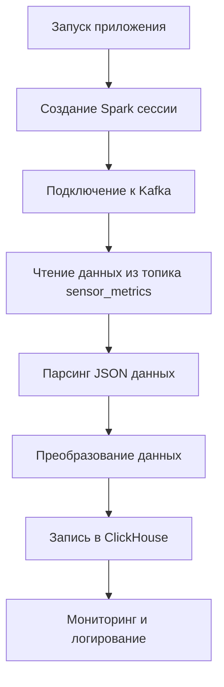

# Описание работы скриптов проекта

## Сервисы проекта
1. **Kafka** - брокер сообщений для потоковой передачи данных
2. **Spark Streaming** - обработка потоковых данных
3. **ClickHouse** - колоночная СУБД для аналитики
4. **MinIO** - S3-совместимое хранилище для данных
5. **Airflow** - оркестрация ETL процессов

## Новые библиотеки
- **minio**: Клиент для работы с MinIO (S3-совместимое хранилище)
- **boto3**: AWS SDK для Python (поддержка S3 API)
- **S3Hook**: Airflow hook для работы с S3 (поддержка load_string/load_str методов)

# Описание работы скрипта streaming_example.py

## 1. Общая схема работы



Основные этапы работы:
1. Инициализация Spark сессии с поддержкой Kafka
2. Подключение к Kafka и подписка на топик `sensor_metrics`
3. Парсинг входящих JSON сообщений
4. Преобразование и валидация данных
5. Пакетная запись в ClickHouse через HTTP API
6. Логирование процесса обработки

## 2. Ключевые функции

### `create_spark_session()`
**Зависимости**:
- pyspark
- minio (для работы с S3)
- boto3 (для работы с AWS S3 API)

Создает и настраивает Spark сессию с необходимыми параметрами:
- Поддержка Kafka через `spark-sql-kafka` пакет
- Настройка имени приложения
- Обработка ошибок инициализации

### `format_clickhouse_insert(data)`
Формирует SQL запрос для вставки данных в ClickHouse:
- Принимает список словарей с данными
- Проверяет наличие обязательных полей
- Генерирует VALUES часть INSERT запроса

### `write_to_clickhouse(batch_df, batch_id)`
Основная функция обработки батчей:
- Подсчет количества записей в батче
- Конвертация DataFrame в список словарей
- Валидация структуры данных
- Формирование и отправка запроса в ClickHouse
- Обработка ответа и ошибок

### `main()`
Главная функция приложения:
- Координирует весь процесс обработки
- Настраивает схему данных
- Запускает streaming queries
- Обеспечивает мониторинг через логи

## 3. Примеры данных

### Входные данные (Kafka message):
```json
{
  "id": "msg-123",
  "timestamp": "2025-07-07T22:00:00Z",
  "value": {
    "sensor_id": "sensor-001",
    "temperature": 23.5,
    "humidity": 45,
    "pressure": 1013
  }
}
```

### Выходные данные (ClickHouse запрос):
```sql
INSERT INTO sensor_metrics VALUES 
('msg-123', '2025-07-07 22:00:00', 'sensor-001', 23.5, 45, 1013)
```

## 4. Обработка ошибок

Система обрабатывает следующие типы ошибок:
- Отсутствие обязательных полей в данных (`KeyError`)
- Ошибки подключения к Kafka и ClickHouse
- Невалидные форматы данных
- Таймауты запросов
- Ошибки парсинга JSON

Все ошибки логируются с деталями через `logging` модуль.

## 5. Рекомендации по модификации

### Интеграция с MinIO
1. Добавить сохранение промежуточных данных в MinIO
2. Реализовать чтение конфигурации из S3
3. Добавить мониторинг использования хранилища

### Использование boto3
1. Реализовать backup данных в S3
2. Добавить загрузку конфигураций из S3
3. Интегрировать с AWS сервисами при необходимости

1. **Конфигурация**: Вынести параметры подключения в конфигурационный файл
2. **Масштабирование**: Добавить обработку backpressure при высокой нагрузке
3. **Мониторинг**: Интегрировать с Prometheus для сбора метрик
4. **Тестирование**: Добавить unit-тесты для ключевых функций
5. **Схема данных**: Реализовать автоматическое создание таблицы в ClickHouse
6. **Ретри**: Добавить механизм повторной отправки при ошибках
7. **Форматы**: Поддержка других форматов данных кроме JSON